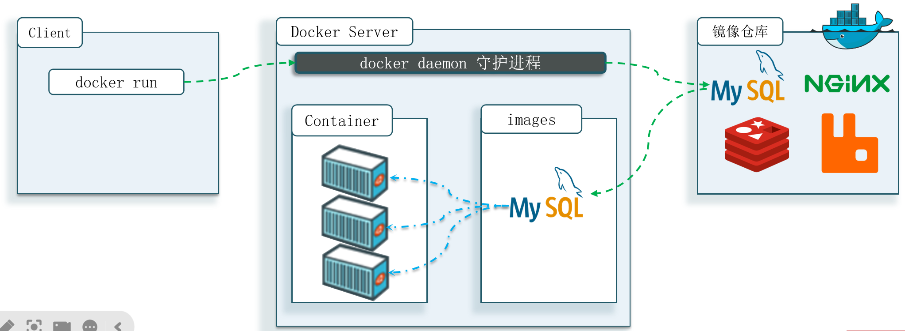
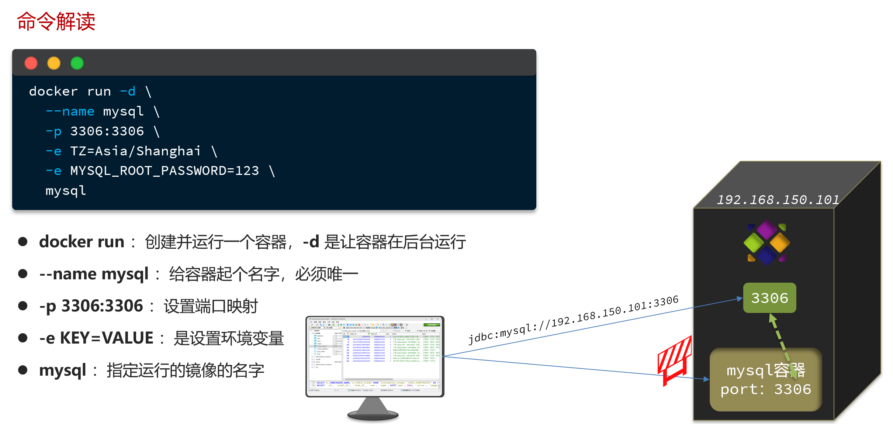
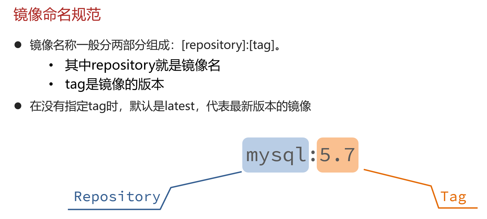
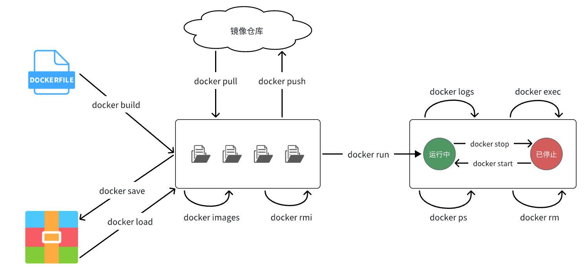
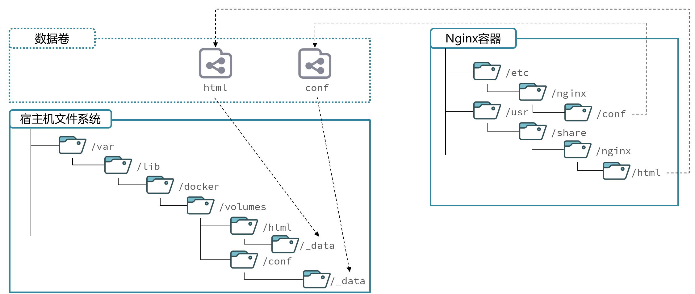
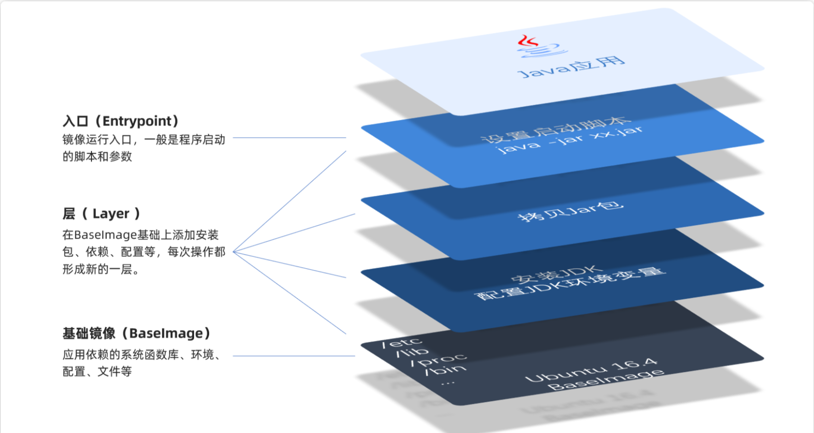

# Docker

## 安装docker

1. 卸载旧版

```shell
yum remove docker \
    docker-client \
    docker-client-latest \
    docker-common \
    docker-latest \
    docker-latest-logrotate \
    docker-logrotate \
    docker-engine \
    docker-selinux
```

2. 配置Docker的yum库

首先要安装一个yum工具
```bash
sudo yum install -y yum-utils device-mapper-persistent-data lvm2

```

安装成功后，执行命令，配置Docker的yum源

```bash
sudo yum-config-manager --add-repo https://mirrors.aliyun.com/docker-ce/linux/centos/docker-ce.repo

sudo sed -i 's+download.docker.com+mirrors.aliyun.com/docker-ce+' /etc/yum.repos.d/docker-ce.repo
```

更新yum，建立缓存

```bash
sudo yum makecache fast
```

3. 安装docker
```bash
yum install -y docker-ce docker-ce-cli containerd.io docker-buildx-plugin docker-compose-plugin
```

4. 启动和校验
```bash
# 启动Docker
systemctl start docker

# 停止Docker
systemctl stop docker

# 重启
systemctl restart docker

# 设置开机自启
systemctl enable docker

# 执行docker ps命令，如果不报错，说明安装启动成功
docker ps
```

5. 配置镜像加速
[Docker/DockerHub 国内镜像源/加速列表](https://xuanyuan.me/blog/archives/1154)

镜像地址可能会变更，如果失效可以百度找最新的docker镜像。
配置镜像步骤如下：

```bash
# 创建目录
mkdir -p /etc/docker

# 复制内容
tee /etc/docker/daemon.json <<-'EOF'
{
    "registry-mirrors": [
        "http://hub-mirror.c.163.com",
        "https://mirrors.tuna.tsinghua.edu.cn",
        "http://mirrors.sohu.com",
        "https://ustc-edu-cn.mirror.aliyuncs.com",
        "https://ccr.ccs.tencentyun.com",
        "https://docker.m.daocloud.io",
        "https://docker.awsl9527.cn"
    ]
}
EOF

# 重新加载配置
systemctl daemon-reload

# 重启Docker
systemctl restart docker
```


## 镜像和容器

当我们利用Docker安装应用时，Docker:会自动搜索并下载应用镜像(image)。镜像不仅包含应用本身，还包含应用
运行所需要的环境、配置、系统函数库。Docker会在运行镜像时创建一个隔离环境，称为容器(container)。

**镜像仓库**: 存储和管理镜像的平台，Docker官方维护了一个公共仓库:[DockerHub](https://hub.docker.com/)


**总结**

>Docker是做什么的?
>
>Docker可以帮助我们下载应用镜像，创建并运行镜像的容器，从而快速部署应用

>什么是镜像?
>
>将应用所需的函数库、依赖、配置等与应用一起打包得到的就是镜像

>什么是容器?
>
>为每个镜像的应用进程创建的隔离运行环境就是容器

>什么是镜像仓库?
>
>存储和管理镜像的服务就是镜像仓库 DockerHub是目前最大的镜像仓库，其中包含各种常见的应用镜像


## 命令解读

```bash
docker run -d \
  --name mysql \
  -p 3306:3306 \
  -e TZ=Asia/Shanghai \
  -e MYSQL_ROOT_PASSWORD=123 \
  mysql
  ```

  就是因为Docker会自动搜索并下载MySQL。注意：这里下载的不是安装包，而是镜像。镜像中不仅包含了MySQL本身，还包含了其运行所需要的环境、配置、系统级函数库。因此它在运行时就有自己独立的环境，就可以跨系统运行，也不需要手动再次配置环境了。这套独立运行的隔离环境我们称为容器。

说明：
- 镜像：英文是image
- 容器：英文是container

解读：
>- docker run -d ：创建并运行一个容器，-d则是让容器以后台进程运行
>- --name mysql  : 给容器起个名字叫mysql，你可以叫别的
>- -p 3306:3306 : 设置端口映射。
>  - 容器是隔离环境，外界不可访问。但是可以将宿主机端口映射容器内到端口，当访问宿主机指定端口时，就是在访问容器内的端口了。
>  - 容器内端口往往是由容器内的进程决定，例如MySQL进程默认端口是3306，因此容器内端口一定是3306；而宿主机端口则可以任意指定，一般与容器内保持一致。
>  - 格式： -p 宿主机端口:容器内端口，示例中就是将宿主机的3306映射到容器内的3306端口
>- -e TZ=Asia/Shanghai : 配置容器内进程运行时的一些参数
>  - 格式：-e KEY=VALUE，KEY和VALUE都由容器内进程决定
>  - 案例中，TZ=Asia/Shanghai是设置时区；MYSQL_ROOT_PASSWORD=123是设置MySQL默认密码
>- mysql : 设置镜像名称，Docker会根据这个名字搜索并下载镜像
>  - 格式：REPOSITORY:TAG，例如mysql:8.0，其中REPOSITORY可以理解为镜像名，TAG是版本号
>  - 在未指定TAG的情况下，默认是最新版本，也就是mysql:latest



镜像的名称不是随意的，而是要到DockerRegistry中寻找，镜像运行时的配置也不是随意的，要参考镜像的帮助文档，这些在DockerHub网站或者软件的官方网站中都能找到。




## 常见命令

|命令|说明|
|----|----|
|docker pull|拉取镜像
|docker push|推送镜像到DockerRegistry
|docker images|查看本地镜像
|docker rmi|删除本地镜像
|docker run|创建并运行容器（不能重复创建）
|docker stop|停止指定容器
|docker start|启动指定容器
|docker restart|重新启动容器
|docker rm|删除指定容器
|docker ps|查看运行的容器
|docker ps -a|查看所有容器
|docker logs|查看容器运行日志
|docker exec|进入容器
|docker save|保存镜像到本地压缩文件
|docker load|加载本地压缩文件到镜像
|docker inspect|查看容器详细信息


Docker最常见的命令就是操作镜像、容器的命令，详见官方文档： https://docs.docker.com/





**如何保存下载好的镜像，并打包？**

```bash
[root@localhost ~]# docker save --help

Usage:  docker save [OPTIONS] IMAGE [IMAGE...]

Save one or more images to a tar archive (streamed to STDOUT by default)

Aliases:
  docker image save, docker save

Options:
  -o, --output string   Write to a file, instead of STDOUT


[root@localhost ~]# docker save -o nginx.tar nginx:latest


[root@localhost ~]# ll
总用量 192044
-rw-------. 1 root root      1241 6月  22 2024 anaconda-ks.cfg
-rw-------. 1 root root 196647424 4月  22 22:32 nginx.tar

```


**如何加载回来呢？**

docker load -i nginx.tar

```bash
[root@localhost ~]# docker load --help

Usage:  docker load [OPTIONS]

Load an image from a tar archive or STDIN

Aliases:
  docker image load, docker load

Options:
  -i, --input string   Read from tar archive file, instead of STDIN
  -q, --quiet          Suppress the load output
[root@localhost ~]# docker load -i nginx.tar
ea680fbff095: Loading layer [==================================================>]   77.9MB/77.9MB
bd903131a05e: Loading layer [==================================================>]  118.7MB/118.7MB
9aad78ecf380: Loading layer [==================================================>]  3.584kB/3.584kB
9e3c6e8c1e25: Loading layer [==================================================>]  4.608kB/4.608kB
8d83f6b79143: Loading layer [==================================================>]   2.56kB/2.56kB
ccc5aac17fc4: Loading layer [==================================================>]   5.12kB/5.12kB
d1e3e4dd1aaa: Loading layer [==================================================>]  7.168kB/7.168kB
Loaded image: nginx:latest
[root@localhost ~]# docker images
REPOSITORY            TAG       IMAGE ID       CREATED        SIZE
nginx                 latest    4e1b6bae1e48   6 days ago     192MB
uums-web              1         d1c9ee2b1a26   8 months ago   946MB
zzy                   1.0.0     5d520aecab93   8 months ago   877MB
tomcat                8         2d2bccf89f53   3 years ago    678MB
redis                 5.0       c5da061a611a   3 years ago    110MB
mysql                 5.6       dd3b2a5dcb48   3 years ago    303MB
centos                7         eeb6ee3f44bd   3 years ago    204MB
mysql                 8.0.25    5c62e459e087   3 years ago    556MB
eclipse/centos_jdk8   latest    5bd02d36ed35   6 years ago    877MB
[root@localhost ~]#
```

**nginx常规操作**

```bash
docker pull nginx

docker images

docker run -d --name nginx -p 80:80 nginx

#查看运行中容器
docker ps
# 也可以加格式化方式访问，格式会更加清爽
docker ps --format "table {{.ID}}\t{{.Image}}\t{{.Ports}}\t{{.Status}}\t{{.Names}}"

#停止容器
docker stop nginx

#再次启动nginx容器
docker start nginx

#查看容器详细信息
docker inspect nginx

# 进入容器,查看容器内目录
docker exec -it nginx bash
# 或者，可以进入MySQL
docker exec -it mysql mysql -uroot -p

#删除容器
docker rm nginx
# 发现无法删除，因为容器运行中，强制删除容器
docker rm -f nginx

#查看日志
docker logs -f nginx

#动态查看日志
docker logs -f bef8969d1e0c


```
补充：

默认情况下，每次重启虚拟机我们都需要手动启动Docker和Docker中的容器。通过命令可以实现开机自启：

```bash
# Docker开机自启
systemctl enable docker

# Docker容器开机自启
docker update --restart=always [容器名/容器id]
```

## 命令别名

```bash
# 修改/root/.bashrc文件
vi /root/.bashrc
内容如下：
# .bashrc

# User specific aliases and functions

alias rm='rm -i'
alias cp='cp -i'
alias mv='mv -i'
alias dps='docker ps --format "table {{.ID}}\t{{.Image}}\t{{.Ports}}\t{{.Status}}\t{{.Names}}"'
alias dis='docker images'

# Source global definitions
if [ -f /etc/bashrc ]; then
        . /etc/bashrc
fi
```

然后，执行命令使别名生效
```bash
source /root/.bashrc
```

## 数据卷

容器是隔离环境，容器内程序的文件、配置、运行时产生的容器都在容器内部，我们要读写容器内的文件非常不方便。大家思考几个问题：
- 如果要升级MySQL版本，需要销毁旧容器，那么数据岂不是跟着被销毁了？
- MySQL、Nginx容器运行后，如果我要修改其中的某些配置该怎么办？
- 我想要让Nginx代理我的静态资源怎么办？

因此，容器提供程序的运行环境，但是程序运行产生的数据、程序运行依赖的配置都应该与容器解耦。

**数据卷（volume）**是一个虚拟目录，是**容器内目录**与**宿主机目录**之间映射的桥梁。

以Nginx为例，我们知道Nginx中有两个关键的目录：
- html：放置一些静态资源
- conf：放置配置文件
如果我们要让Nginx代理我们的静态资源，最好是放到html目录；如果我们要修改Nginx的配置，最好是找到conf下的nginx.conf文件。
但遗憾的是，容器运行的Nginx所有的文件都在容器内部。所以我们必须利用数据卷将两个目录与宿主机目录关联，方便我们操作。如图：



在上图中：
- 我们创建了两个数据卷：`conf`、`html`
- Nginx容器内部的conf目录和html目录分别与两个数据卷关联。
- 而数据卷conf和html分别指向了宿主机的`/var/lib/docker/volumes/conf/_data`目录和`/var/lib/docker/volumes/html/_data`目录

这样以来，容器内的conf和html目录就 与宿主机的conf和html目录关联起来，我们称为**挂载**。此时，我们操作宿主机的`/var/lib/docker/volumes/html/_data`就是在操作容器内的`/usr/share/nginx/html/_data`目录。只要我们将静态资源放入宿主机对应目录，就可以被Nginx代理了。

:::tip
`/var/lib/docker/volumes`这个目录就是默认的存放所有容器数据卷的目录，其下再根据数据卷名称创建新目录，格式为`/数据卷名/_data`。
:::

### 数据卷命令

|命令|说明|
|----|----|
|docker volume create|创建数据卷
|docker volume ls|查看所有数据卷
|docker volume rm|删除指定数据卷
|docker volume inspect|查看某个数据卷的详情
|docker volume prune|清除数据卷

注意：容器与数据卷的挂载要在创建容器时配置，对于创建好的容器，是不能设置数据卷的。而且**创建容器的过程中，数据卷会自动创建**。

```bash
docker run -d --name nginx -p 80:80 -v html:/usr/share/nginx/html nginx


docker volume ls


[root@localhost ~]# docker volume ls
DRIVER    VOLUME NAME
local     html
[root@localhost ~]# docker volume inspect html
[
    {
        "CreatedAt": "2025-04-23T21:37:48+08:00",
        "Driver": "local",
        "Labels": null,
        "Mountpoint": "/var/lib/docker/volumes/html/_data",
        "Name": "html",
        "Options": null,
        "Scope": "local"
    }
]

[root@localhost ~]# cd /var/lib/docker/volumes/html/_data
[root@localhost _data]# ls
50x.html  index.html

#进入容器内部，查看/usr/share/nginx/html目录内的文件是否变化
docker exec -it nginx bash


```


### 总结

**什么是数据卷?**
- 数据卷是一个虚拟目录，它将宿主机目录映射到容器内目录，方便我们操作容器内文件，或者方便迁移容器产生的数据

**如何挂载数据卷?**
- 在创建容器时，利用-v数据卷名:容器内目录完成挂载

- 容器创建时，如果发现挂载的数据卷不存在时，会自动创建

**数据卷的常见命令有哪些?**

- docker volume ls:查看数据卷
- docker volumerm:删除数据卷
- docker volumeinspect:查看数据卷详情
- docker volume prune:删除未使用的数据卷


### 挂载本地目录

**mysql挂载**

数据卷的目录结构较深，如果我们去操作数据卷目录会不太方便。在很多情况下，我们会直接将容器目录与宿主机指定目录挂载。挂载语法与数据卷类似：

```bash
# 挂载本地目录
-v 本地目录:容器内目录
# 挂载本地文件
-v 本地文件:容器内文件
```

注意：本地目录或文件必须以 / 或 ./开头，如果直接以名字开头，会被识别为数据卷名而非本地目录名。


例如
```
-v mysql:/var/lib/mysql # 会被识别为一个数据卷叫mysql，运行时会自动创建这个数据卷
-v ./mysql:/var/lib/mysql # 会被识别为当前目录下的mysql目录，运行时如果不存在会创建目录
```

mysql挂载位置

- 挂载`/root/mysql/data`到容器内的`/var/lib/mysql`目录
- 挂载`/root/mysql/init`到容器内的`/docker-entrypoint-initdb.d`目录（初始化的SQL脚本目录）
- 挂载`/root/mysql/conf`到容器内的`/etc/mysql/conf.d`目录（这个是MySQL配置文件目录）

init放`xxx.sql`，初始化时只会执行一次

conf放`xxx.cnf`文件

**本地目录挂载：**

```bash
# 1.删除原来的MySQL容器
docker rm -f mysql

# 2.进入root目录
cd ~

# 3.创建并运行新mysql容器，挂载本地目录
docker run -d \
  --name mysql \
  -p 3306:3306 \
  -e TZ=Asia/Shanghai \
  -e MYSQL_ROOT_PASSWORD=123 \
  -v ./mysql/data:/var/lib/mysql \
  -v ./mysql/conf:/etc/mysql/conf.d \
  -v ./mysql/init:/docker-entrypoint-initdb.d \
  mysql

# 5.1.进入MySQL
docker exec -it mysql mysql -uroot -p123
# 5.2.查看编码表
show variables like "%char%";

# 查看数据库
show databases;


# 切换到xxx数据库
use xxx;

#查看表
show tables;


```

## 镜像

**镜像结构**

镜像之所以能让我们快速跨操作系统部署应用而忽略其运行环境、配置，就是因为镜像中包含了程序运行需要的系统函数库、环境、配置、依赖。

因此，自定义镜像本质就是依次准备好程序运行的基础环境、依赖、应用本身、运行配置等文件，并且打包而成。

那因此，我们打包镜像也是分成这么几步：
- 准备Linux运行环境（java项目并不需要完整的操作系统，仅仅是基础运行环境即可）
- 安装并配置JDK
- 拷贝jar包
- 配置启动脚本

上述步骤中的每一次操作其实都是在生产一些文件（系统运行环境、函数库、配置最终都是磁盘文件），所以**镜像就是一堆文件的集合**。

但需要注意的是，镜像文件不是随意堆放的，而是按照操作的步骤分层叠加而成，每一层形成的文件都会单独打包并标记一个唯一id，称为**Layer（层）**。这样，如果我们构建时用到的某些层其他人已经制作过，就可以直接拷贝使用这些层，而不用重复制作。

例如，第一步中需要的Linux运行环境，通用性就很强，所以Docker官方就制作了这样的只包含Linux运行环境的镜像。我们在制作java镜像时，就无需重复制作，直接使用Docker官方提供的CentOS或Ubuntu镜像作为基础镜像。然后再搭建其它层即可，这样逐层搭建，最终整个Java项目的镜像结构如图所示：




### Dockerfile
记录镜像结构的文件就称为Dockerfile，其对应的语法可以参考官方文档：
https://docs.docker.com/engine/reference/builder/

其中的语法比较多，比较常用的有：

|指令|说明|示例|
|------|------|-----|
|FROM|指定基础镜像|`FROM centos:6`
|ENV|设置环境变量，可在后面指令使用|`ENV key value`
|COPY|拷贝本地文件到镜像的指定目录|`COPY ./xx.jar /tmp/app.jar`
|RUN|执行Linux的shell命令，一般是安装过程的命令|`RUN yum install gcc`
|EXPOSE|指定容器运行时监听的端口，是给镜像使用者看的|`EXPOSE 8080`
|ENTRYPOINT|镜像中应用的启动命令，容器运行时调用|`ENTRYPOINT java -jar xx.jar`


例如，要基于Ubuntu镜像来构建一个Java应用，其Dockerfile内容如下：

```docker
# 指定基础镜像
FROM ubuntu:16.04
# 配置环境变量，JDK的安装目录、容器内时区
ENV JAVA_DIR=/usr/local
ENV TZ=Asia/Shanghai
# 拷贝jdk和java项目的包
COPY ./jdk8.tar.gz $JAVA_DIR/
COPY ./docker-demo.jar /tmp/app.jar
# 设定时区
RUN ln -snf /usr/share/zoneinfo/$TZ /etc/localtime && echo $TZ > /etc/timezone
# 安装JDK
RUN cd $JAVA_DIR \
 && tar -xf ./jdk8.tar.gz \
 && mv ./jdk1.8.0_144 ./java8
# 配置环境变量
ENV JAVA_HOME=$JAVA_DIR/java8
ENV PATH=$PATH:$JAVA_HOME/bin
# 指定项目监听的端口
EXPOSE 8080
# 入口，java项目的启动命令
ENTRYPOINT ["java", "-jar", "/app.jar"]
```

以后我们会有很多很多java项目需要打包为镜像，他们都需要Linux系统环境、JDK环境这两层，只有上面的3层不同（因为jar包不同）。如果每次制作java镜像都重复制作前两层镜像，是不是很麻烦。

所以，就有人提供了基础的系统加JDK环境，我们在此基础上制作java镜像，就可以省去JDK的配置了：


```docker title="Dockerfile"
# 基础镜像
FROM openjdk:11.0-jre-buster
# 设定时区
ENV TZ=Asia/Shanghai
RUN ln -snf /usr/share/zoneinfo/$TZ /etc/localtime && echo $TZ > /etc/timezone
# 拷贝jar包
COPY docker-demo.jar /app.jar
# 入口
ENTRYPOINT ["java", "-jar", "/app.jar"]
```


### 构建镜像

**命令**
```bash
# 进入镜像目录
cd /root/demo
# 开始构建
docker build -t docker-demo:1.0 .
```

命令说明：
- `docker build` : 就是构建一个docker镜像
- `-t docker-demo:1.0` ：`-t`参数是指定镜像的名称（`repository`和`tag`）
- ` .` : 最后的点是指构建时**Dockerfile所在路径**，由于我们进入了demo目录，所以指定的是`.`代表当前目录，也可以直接指定`Dockerfile`目录：

```bash
# 直接指定Dockerfile目录
docker build -t docker-demo:1.0 /root/demo
```

#### Java部署示例
上传我们写好的`Dockerfile`和`jar包`


```docker title="Dockerfile"
# 基础镜像
FROM openjdk:11.0-jre-buster
# 设定时区
ENV TZ=Asia/Shanghai
RUN ln -snf /usr/share/zoneinfo/$TZ /etc/localtime && echo $TZ > /etc/timezone
# 拷贝jar包
COPY docker-demo.jar /app.jar
# 入口
ENTRYPOINT ["java", "-jar", "/app.jar"]
```

执行命令

```bash {1,15,20,26,29}
[root@localhost demo]# docker build -t docker-demo:1.0 .

[+] Building 35.5s (8/8) FINISHED                                                             docker:default
 => [internal] load build definition from Dockerfile                                                    0.0s
 => => transferring dockerfile: 359B                                                                    0.0s
 => [internal] load metadata for docker.io/library/openjdk:11.0-jre-buster                              9.7s
 => [internal] load .dockerignore                                                                       0.0s
 => => transferring context: 2B                                                                         0.0s
 => [1/3] FROM docker.io/library/openjdk:11.0-jre-buster@sha256:569ba9252ddd693a29d39e81b3123481f308e  23.4s
 => => resolve docker.io/library/openjdk:11.0-jre-buster@sha256:569ba9252ddd693a29d39e81b3123481f308eb  0.0s
 => => sha256:4fe4e1c58b4af82939a918665dd1e7b5b636dd73c710b4bccb530edbb15470d2 7.86MB / 7.86MB         16.1s
.........


root@localhost demo]# docker images

REPOSITORY            TAG       IMAGE ID       CREATED          SIZE
docker-demo           1.0       678e0af7095e   32 seconds ago   315MB

[root@localhost demo]# docker run -d --name dockerDemo -p 8080:8080 docker-demo:1.0

364781fb488c583e3d2e59daaf7546a1975338851b29207d952d447f07634982
[root@localhost demo]# dps
CONTAINER ID   IMAGE             PORTS                                       STATUS         NAMES
7e90d418321d   docker-demo:1.0   0.0.0.0:8080->8080/tcp, :::8080->8080/tcp   Up 3 seconds   dockerDemo
[root@localhost demo]# curl localhost:8080/hello/count
<h5>欢迎访问商城, 这是您第1次访问<h5>[root@localhost demo]#

[root@localhost demo]# docker logs dockerDemo

  .   ____          _            __ _ _
 /\\ / ___'_ __ _ _(_)_ __  __ _ \ \ \ \
( ( )\___ | '_ | '_| | '_ \/ _` | \ \ \ \
 \\/  ___)| |_)| | | | | || (_| |  ) ) ) )
  '  |____| .__|_| |_|_| |_\__, | / / / /
 =========|_|==============|___/=/_/_/_/
 :: Spring Boot ::               (v2.7.12)

21:28:56  INFO 1 --- [           main] com.itheima.mp.MpDemoApplication         : Starting MpDemoApplication v0.0.1-SNAPSHOT using Java 11.0.16 on 7e90d418321d with PID 1 (/app.jar started by root in /)
21:28:56 DEBUG 1 --- [           main] com.itheima.mp.MpDemoApplication         : Running with Spring Boot v2.7.12, Spring v5.3.27
21:28:56  INFO 1 --- [           main] com.itheima.mp.MpDemoApplication         : No active profile set, falling back to 1 default profile: "default"
21:28:58  INFO 1 --- [           main] o.s.b.w.embedded.tomcat.TomcatWebServer  : Tomcat initialized with port(s): 8080 (http)
21:28:58  INFO 1 --- [           main] o.apache.catalina.core.StandardService   : Starting service [Tomcat]
21:28:58  INFO 1 --- [           main] org.apache.catalina.core.StandardEngine  : Starting Servlet engine: [Apache Tomcat/9.0.75]
21:28:58  INFO 1 --- [           main] o.a.c.c.C.[Tomcat].[localhost].[/]       : Initializing Spring embedded WebApplicationContext
21:28:58  INFO 1 --- [           main] w.s.c.ServletWebServerApplicationContext : Root WebApplicationContext: initialization completed in 2075 ms
21:28:59  INFO 1 --- [           main] o.s.b.w.embedded.tomcat.TomcatWebServer  : Tomcat started on port(s): 8080 (http) with context path ''
21:28:59  INFO 1 --- [           main] com.itheima.mp.MpDemoApplication         : Started MpDemoApplication in 4.308 seconds (JVM running for 4.953)
21:29:03  INFO 1 --- [nio-8080-exec-1] o.a.c.c.C.[Tomcat].[localhost].[/]       : Initializing Spring DispatcherServlet 'dispatcherServlet'
21:29:03  INFO 1 --- [nio-8080-exec-1] o.s.web.servlet.DispatcherServlet        : Initializing Servlet 'dispatcherServlet'
21:29:03  INFO 1 --- [nio-8080-exec-1] o.s.web.servlet.DispatcherServlet        : Completed initialization in 1 ms
[root@localhost demo]#
```

### 总结
镜像的结构是怎样的?

- 镜像中包含了应用程序所需要的运行环境、函数库、配置、以及应用本身等各种文件，这些文件分层打包而成，

Dockerfile是做什么的?

- Dockerfile就是利用固定的指令来描述镜像的结构和构建过程，这样Docker才可以依次来构建镜像

构建镜像的命令是什么?

- docker build -t 镜像名 [Dockerfile目录]


## 容器网络互联


刚刚我们创建了一个Java项目的容器，而Java项目往往需要访问其它各种中间件，例如MySQL、Redis等。现在，我们的容器之间能否互相访问呢？我们来测试一下

首先，我们查看下Nginx容器的详细信息，重点关注其中的网络IP地址：

```bash
docker inspect nginx

  "Networks": {
                "bridge": {
                    "IPAMConfig": null,
                    "Links": null,
                    "Aliases": null,
                    "MacAddress": "02:42:ac:11:00:04",
                    "NetworkID": "8bbc5fd1fe07fc2539250796feede9bb5c617c28b0f64521e9744b1ffb5cd8ea",
                    "EndpointID": "4e20a441965ddedc5264bf9296546342448c4aeb965324eedff362293fa6c809",
                    "Gateway": "172.17.0.1",
                    "IPAddress": "172.17.0.4",
                    "IPPrefixLen": 16,
                    "IPv6Gateway": "",
                    "GlobalIPv6Address": "",
                    "GlobalIPv6PrefixLen": 0,
                    "DriverOpts": null,
                    "DNSNames": null
                }
            }

[root@localhost ~]# docker exec -it dockerDemo bash

root@7e90d418321d:/# ping 172.17.0.4
PING 172.17.0.4 (172.17.0.4) 56(84) bytes of data.
64 bytes from 172.17.0.4: icmp_seq=1 ttl=64 time=0.286 ms
64 bytes from 172.17.0.4: icmp_seq=2 ttl=64 time=0.085 ms
64 bytes from 172.17.0.4: icmp_seq=3 ttl=64 time=0.092 ms
64 bytes from 172.17.0.4: icmp_seq=4 ttl=64 time=0.087 ms


```

发现可以互联，没有问题。

但是，容器的网络IP其实是一个虚拟的IP，其值并不固定与某一个容器绑定，如果我们在开发时写死某个IP，而在部署时很可能MySQL容器的IP会发生变化，连接会失败。

所以，我们必须借助于docker的网络功能来解决这个问题，官方文档：https://docs.docker.com/engine/reference/commandline/network/

**常见命令有：**
|命令|说明|
|----|-----|
|`docker network create`|创建一个网络|
|`docker network ls`|查看所有网络|
|`docker network rm`|删除指定网络|
|`docker network prune`|清除未使用的网络|
|`docker network connect`|使指定容器连接加入某网络|
|`docker network disconnect`|使指定容器连接离开某网络|
|`docker network inspect`|查看网络详细信息|


### 自定义网络

```bash
# 1.首先通过命令创建一个网络
docker network create customizeNetwork

# 2.然后查看网络
docker network ls
# 结果：
NETWORK ID     NAME      DRIVER    SCOPE
639bc44d0a87   bridge    bridge    local
403f16ec62a2   customizeNetwork     bridge    local
0dc0f72a0fbb   host      host      local
cd8d3e8df47b   none      null      local
# 其中，除了customizeNetwork以外，其它都是默认的网络

# 3.让dockerDemo和mysql都加入该网络，注意，在加入网络时可以通过--alias给容器起别名
# 这样该网络内的其它容器可以用别名互相访问！
# 3.1.mysql容器，指定别名为db，另外每一个容器都有一个别名是容器名
docker network connect customizeNetwork mysql --alias db
# 3.2.dockerDemo容器，也就是我们的java项目
docker network connect customizeNetwork dockerDemo

# 4.进入dockerDemo容器，尝试利用别名访问db
# 4.1.进入容器
docker exec -it dockerDemo bash
# 4.2.用db别名访问
ping db
# 结果
PING db (172.18.0.2) 56(84) bytes of data.
64 bytes from mysql.hmall (172.18.0.2): icmp_seq=1 ttl=64 time=0.070 ms
64 bytes from mysql.hmall (172.18.0.2): icmp_seq=2 ttl=64 time=0.056 ms
# 4.3.用容器名访问
ping mysql
# 结果：
PING mysql (172.18.0.2) 56(84) bytes of data.
64 bytes from mysql.hmall (172.18.0.2): icmp_seq=1 ttl=64 time=0.044 ms
64 bytes from mysql.hmall (172.18.0.2): icmp_seq=2 ttl=64 time=0.054 ms
```

现在无需记住IP地址也可以实现容器互联了。

**总结：**
- 在自定义网络中，可以给容器起多个别名，默认的别名是容器名本身
- 在同一个自定义网络中的容器，可以通过别名互相访问


## 部署项目

上传我们的`jar包`和`Dockerfile`

```bash
docker build -t 项目名:版本 .
```

### **网络**

```bash
docker network create xxx-network

docker network connect xxx-network mysql --alias db

docker network connect xxxx-network nginx
```


### Mysql

```bash
# 拉取最新版本
docker pull mysql

# 拉取指定版本（推荐）
docker pull mysql:8.0.35
docker pull mysql:5.7.44

# 查看已下载的镜像
docker images | grep mysql
```

**创建项目目录结构**
```bash
# 创建MySQL项目目录
mkdir -p /opt/mysql-docker/{data,conf,logs,init}
cd /opt/mysql-docker

# 目录结构说明
tree
/opt/mysql-docker/
├── data/           # MySQL数据文件
├── conf/           # MySQL配置文件
├── logs/           # MySQL日志文件
└── init/           # 初始化SQL脚本
```


**创建自定义配置文件**`my.cnf`

cnf文件:
```txt title="xxx.cnf"
[client]
default_character_set=utf8mb4
[mysql]
default_character_set=utf8mb4
[mysqld]
character_set_server=utf8mb4
collation_server=utf8mb4_unicode_ci
init_connect='SET NAMES utf8mb4'
```

**创建初始化脚本**

你的`xxx.sql`，sql文件

**运行完整配置的MySQL容器**
```bash
docker run -d \
  --name mysql \
  -p 3306:3306 \
  -e TZ=Asia/Shanghai \
  -e MYSQL_ROOT_PASSWORD=123 \
  -v ./mysql/data:/var/lib/mysql \
  -v ./mysql/conf:/etc/mysql/conf.d \
  -v ./mysql/init:/docker-entrypoint-initdb.d \
  -v ./mysql/logs:/var/log/mysql \
  --network hmall-network \
  --restart always \
  mysql:latest


# 参数详解：
# -e MYSQL_ROOT_PASSWORD: root密码
# -v: 数据卷挂载
# 你的xxx.sql文件放在 mysql/init下
# my.cnf文件放在 mysql/conf下
```


**验证MySQL运行**
```bash
# 查看容器状态
docker ps | grep mysql

# 查看容器日志
docker logs my-mysql

# 进入MySQL容器
docker exec -it my-mysql bash

# 在容器内连接MySQL
mysql -u root -p
# 输入密码：123456

# 测试SQL命令
SHOW DATABASES;
SELECT VERSION();
EXIT;
```

---

#### 备份及迁移

**查看当前环境**
```bash
# 查看当前MySQL容器信息
docker ps | grep mysql
docker inspect mysql | grep Image

# 查看当前MySQL版本
docker exec -it mysql mysql -u root -p -e "SELECT VERSION();"

# 查看数据挂载情况
docker inspect mysql | grep -A 10 "Mounts"
```

**检查新镜像版本**
```bash
# 查看可用的MySQL版本
docker search mysql
docker hub search mysql

# 拉取目标版本镜像（先不要删除旧的）
docker pull mysql:8.0.36  # 举例：升级到新版本
```

🛡️ **数据备份**

使用mysqldump备份
```bash
# 创建备份目录
mkdir -p /backup/mysql/$(date +%Y%m%d)
cd /backup/mysql/$(date +%Y%m%d)

# 备份所有数据库
docker exec mysql mysqldump -u root -p123 --all-databases --routines --triggers > all_databases_backup.sql

# 备份指定数据库（推荐分别备份）
docker exec mysql mysqldump -u root -p123 --databases your_db1 your_db2 > databases_backup.sql

# 验证备份文件
ls -la *.sql
head -n 20 all_databases_backup.sql
```

**删除旧容器（保留数据）**
```bash
# 只删除容器，不删除挂载的数据
docker rm mysql

# 确认数据目录依然存在
ls -la /opt/mysql-docker/data/
```

**使用新镜像创建容器**
```bash
# 使用新镜像运行容器（使用相同的数据挂载）
docker run -d \
  --name mysql \
  -p 3306:3306 \
  -e TZ=Asia/Shanghai \
  -e MYSQL_ROOT_PASSWORD=123 \
  -v /opt/mysql-docker/data:/var/lib/mysql \
  -v /opt/mysql-docker/conf:/etc/mysql/conf.d \
  -v /opt/mysql-docker/init:/docker-entrypoint-initdb.d \
  -v /opt/mysql-docker/logs:/var/log/mysql \
  --restart always \
  mysql:8.0.36  # 新的镜像版本
```

**验证和测试**
```bash
# 查看容器状态
docker ps | grep mysql

# 查看启动日志
docker logs mysql

# 连接MySQL验证
docker exec -it mysql mysql -u root -p123 -e "SELECT VERSION();"

# 验证数据完整性
docker exec -it mysql mysql -u root -p123 -e "SHOW DATABASES;"
docker exec -it mysql mysql -u root -p123 -e "USE your_database; SHOW TABLES;"

# 测试应用连接
# 启动你的应用，测试数据库连接和功能
```


### Nginx

**创建项目目录**
```bash
mkdir -p /root/nginx/{conf,conf.d,html,logs,ssl}
cd /root/nginx

# 查看目录结构
tree
/root/nginx/
├── conf/           # 主配置目录
├── conf.d/         # 站点配置目录
├── html/           # 网站文件目录
├── logs/           # 日志目录
└── ssl/            # SSL证书目录
```

**主配置文件**
```
# 创建主配置文件
cat > /root/nginx/conf/nginx.conf << 'EOF'
user nginx;
worker_processes auto;
error_log /var/log/nginx/error.log warn;
pid /var/run/nginx.pid;

events {
    worker_connections 1024;
}

http {
    include /etc/nginx/mime.types;
    default_type application/octet-stream;

    log_format main '$remote_addr - $remote_user [$time_local] "$request" '
                   '$status $body_bytes_sent "$http_referer" '
                   '"$http_user_agent" "$http_x_forwarded_for"';

    access_log /var/log/nginx/access.log main;

    sendfile on;
    keepalive_timeout 65;

    # 重要：包含conf.d目录下的所有配置文件
    include /etc/nginx/conf.d/*.conf;
}
EOF
```


**站点配置文件**
```
# 创建默认站点配置
cat > /root/nginx/conf.d/default.conf << 'EOF'
server {
    listen 80;
    server_name localhost;

    root /usr/share/nginx/html;
    index index.html index.htm;

    access_log /var/log/nginx/access.log main;
    error_log /var/log/nginx/error.log;

    location / {
        try_files $uri $uri/ /index.html;
    }

    # API代理
    location /api/ {
        proxy_pass http://backend:8080/;
        proxy_set_header Host $host;
        proxy_set_header X-Real-IP $remote_addr;
        proxy_set_header X-Forwarded-For $proxy_add_x_forwarded_for;
        proxy_set_header X-Forwarded-Proto $scheme;
    }
}
EOF
```


```bash
docker run -d \
      --name nginx \
      -p 80:80 \
      -p 443:443 \
      -v /root/nginx/conf.d/:/etc/nginx/conf.d \
      -v /root/nginx/conf/nginx.conf:/etc/nginx/conf/nginx.conf \
      -v /root/nginx/ssl:/etc/nginx/ssl \
      -v /root/nginx/html:/usr/share/nginx/html \
      -v /root/nginx/logs:/var/log/nginx \
      --network xxx-network
      --restart always \
      nginx


# 参数详解：
# --name nginx: 容器名称
# -p 80:80: HTTP端口映射
# -p 443:443: HTTPS端口映射
# -v: 挂载配置、网站文件、日志等
# --restart always: 自动重启
```

**验证部署**
```bash
# 查看容器状态
docker ps | grep nginx

# 查看Nginx日志
docker logs nginx

# 测试HTTP访问
curl http://localhost
curl -I http://localhost

# 测试配置文件语法
docker exec nginx nginx -t

# 重新加载配置（无需重启）
docker exec nginx nginx -s reload
```

---

前端两个项目，admin端，客户端部署示例：

```bash
docker run -d \
  --name nginx \
  -p 18080:18080 \
  -p 18081:18081 \
  -v /root/nginx/html:/usr/share/nginx/html \
  -v /root/nginx/nginx.conf:/etc/nginx/nginx.conf \
  --network hmall \
  nginxs
```

⚠️ 配置文件中，这里不要写死，用于容器之间互相通信；

该容器名称是指后端部署的项目，使用容器名称代替ip地址 (因为项目重启后网桥ip是会变的)


```txt title="nginx.conf"

worker_processes  1;

events {
    worker_connections  1024;
}

http {
    include       mime.types;
    default_type  application/json;

    sendfile        on;

    keepalive_timeout  65;

    server {
        listen       18080;
        # 指定前端项目所在的位置
        location / {
            root /usr/share/nginx/html/hmall-portal;
        }

        error_page   500 502 503 504  /50x.html;
        location = /50x.html {
            root   html;
        }
        location /api {
            rewrite /api/(.*)  /$1 break;
            proxy_pass http://hmall:8080;
        }
    }
    server {
        listen       18081;
        # 指定前端项目所在的位置
        location / {
            root /usr/share/nginx/html/hmall-admin;
        }

        error_page   500 502 503 504  /50x.html;
        location = /50x.html {
            root   html;
        }
        location /api {
            rewrite /api/(.*)  /$1 break;
            proxy_pass http://hmall:8080;
        }
    }
}

```


### Redis
**创建项目目录**
```bash
# 创建Redis项目目录
mkdir -p /opt/redis-docker/{conf,data,logs}
cd /opt/redis-docker

# 目录结构说明
tree
/opt/redis-docker/
├── conf/           # 配置文件目录
├── data/           # 数据持久化目录
└── logs/           # 日志文件目录
```

**创建Redis配置文件**
```txt title="redis.conf" {18}
# 创建Redis配置文件
cat > /opt/redis-docker/conf/redis.conf << 'EOF'
# ==================== 基础配置 ====================
# 绑定地址（0.0.0.0允许所有IP访问）
bind 0.0.0.0

# 端口号
port 6379

# 超时设置（0表示不超时）
timeout 0

# TCP keepalive
tcp-keepalive 300

# ==================== 安全配置 ====================
# 设置密码（生产环境必须设置）
requirepass your_redis_password_123

# 禁用危险命令
rename-command FLUSHDB ""
rename-command FLUSHALL ""
rename-command DEBUG ""
rename-command CONFIG "CONFIG_d83jf93jf"

# ==================== 持久化配置 ====================
# RDB持久化配置
save 900 1        # 900秒内至少1个key变化时保存
save 300 10       # 300秒内至少10个key变化时保存
save 60 10000     # 60秒内至少10000个key变化时保存

# RDB文件名和位置
dbfilename dump.rdb
dir /data

# 压缩RDB文件
rdbcompression yes

# 校验RDB文件
rdbchecksum yes

# AOF持久化配置
appendonly yes
appendfilename "appendonly.aof"
appendfsync everysec     # 每秒同步一次

# AOF重写配置
auto-aof-rewrite-percentage 100
auto-aof-rewrite-min-size 64mb

# ==================== 内存配置 ====================
# 最大内存限制（根据服务器内存调整）
maxmemory 1gb

# 内存溢出策略
maxmemory-policy allkeys-lru

# ==================== 日志配置 ====================
# 日志级别：debug, verbose, notice, warning
loglevel notice

# 日志文件（空表示输出到stdout）
logfile /var/log/redis/redis-server.log

# ==================== 性能优化 ====================
# 数据库数量
databases 16

# 客户端连接数
maxclients 10000

# TCP缓冲区
tcp-backlog 511

# 惰性删除
lazyfree-lazy-eviction yes
lazyfree-lazy-expire yes
lazyfree-lazy-server-del yes

# ==================== 慢查询日志 ====================
# 慢查询阈值（微秒）
slowlog-log-slower-than 10000

# 慢查询日志长度
slowlog-max-len 128
EOF
```

**运行Redis容器**
```bash
docker run -d \
  --name redis-server \
  -p 6379:6379 \
  -v /opt/redis-docker/conf/redis.conf:/etc/redis/redis.conf \  # 挂载配置文件
  -v /opt/redis-docker/data:/data \
  -v /opt/redis-docker/logs:/var/log/redis \
  --restart always \
  redis:7.2-alpine \                    # ← 使用这个镜像
  redis-server /etc/redis/redis.conf   # ← 执行这个命令

# 流程说明：
# 1. Docker拉取 redis:7.2-alpine 镜像
# 2. 创建容器，挂载本地配置文件到容器的 /etc/redis/redis.conf
# 3. 容器启动时执行命令：redis-server /etc/redis/redis.conf
# 4. Redis读取配置文件，发现 requirepass 设置，启用密码认证
```

**验证Redis部署**
```bash
# 查看容器状态
docker ps | grep redis

# 查看Redis日志
docker logs redis-server

# 连接Redis（带密码）
docker exec -it redis-server redis-cli -a your_redis_password_123

# 或者不进入容器直接执行命令
docker exec redis-server redis-cli -a your_redis_password_123 ping
docker exec redis-server redis-cli -a your_redis_password_123 info
```

🧪 **Redis功能测试**
```bash
# 进入Redis CLI
docker exec -it redis-server redis-cli -a your_redis_password_123

# 测试基础操作
127.0.0.1:6379> ping
PONG

# 字符串操作
127.0.0.1:6379> set name "张三"
OK
127.0.0.1:6379> get name
"张三"


# 哈希操作
127.0.0.1:6379> hset user:1 name "李四" age 25
(integer) 2
127.0.0.1:6379> hgetall user:1
1) "name"
2) "李四"
3) "age"
4) "25"

# 查看数据库信息
127.0.0.1:6379> info
127.0.0.1:6379> dbsize

# 退出
127.0.0.1:6379> exit
```

🔧 **常用管理命令**
```bash
# 查看Redis容器状态
docker ps | grep redis
docker stats redis-server

# 查看Redis日志
docker logs redis-server
docker logs -f redis-server --tail 100

# 重启Redis容器
docker restart redis-server

# 停止/启动Redis容器
docker stop redis-server
docker start redis-server

# 进入Redis容器
docker exec -it redis-server redis-cli -a your_redis_password_123
```

**Redis命令**
```bash
# 查看Redis信息
docker exec redis-server redis-cli -a your_redis_password_123 info
docker exec redis-server redis-cli -a your_redis_password_123 info memory
docker exec redis-server redis-cli -a your_redis_password_123 info clients

# 查看配置
docker exec redis-server redis-cli -a your_redis_password_123 config get "*"

# 重新加载配置
docker exec redis-server redis-cli -a your_redis_password_123 config rewrite

# 查看慢查询
docker exec redis-server redis-cli -a your_redis_password_123 slowlog get 10

# 清空数据库（小心使用）
docker exec redis-server redis-cli -a your_redis_password_123 flushdb
```

### RabbitMQ

**创建项目目录**
```
# 创建RabbitMQ项目目录
mkdir -p /opt/rabbitmq-docker/{data,logs,config,plugins}
cd /opt/rabbitmq-docker

# 目录结构说明
tree
/opt/rabbitmq-docker/
├── config/         # 配置文件目录
├── data/           # 数据持久化目录
├── logs/           # 日志文件目录
└── plugins/        # 插件目录
```

**创建RabbitMQ配置文件**
```
# 创建RabbitMQ配置文件
cat > /opt/rabbitmq-docker/config/rabbitmq.conf << 'EOF'
# ==================== 基础配置 ====================
# 监听地址（0.0.0.0允许所有IP访问）
listeners.tcp.default = 5672

# 日志级别：debug, info, warning, error, critical, none
log.console.level = info
log.file.level = info

# ==================== 管理界面配置 ====================
# 启用管理插件
management.tcp.port = 15672
management.tcp.ip = 0.0.0.0

# ==================== 用户和权限配置 ====================
# 禁用guest用户远程访问（安全考虑）
loopback_users.guest = false

# ==================== 内存和磁盘配置 ====================
# 内存高水位阈值（当内存使用超过此值时会阻塞生产者）
vm_memory_high_watermark.relative = 0.6

# 磁盘空间低水位阈值
disk_free_limit.relative = 2.0

# ==================== 集群配置 ====================
# 集群节点类型（disc：磁盘节点，ram：内存节点）
cluster_formation.peer_discovery_backend = rabbit_peer_discovery_classic_config

# ==================== 心跳配置 ====================
# 客户端心跳间隔（秒）
heartbeat = 60

# ==================== 队列配置 ====================
# 默认队列类型
default_queue_type = classic

# ==================== SSL/TLS配置（可选） ====================
# 如果需要SSL，取消注释并配置证书路径
# listeners.ssl.default = 5671
# ssl_options.cacertfile = /etc/rabbitmq/certs/ca_certificate.pem
# ssl_options.certfile = /etc/rabbitmq/certs/server_certificate.pem
# ssl_options.keyfile = /etc/rabbitmq/certs/server_key.pem
EOF
```

**创建用户初始化脚本**

根据实际情况，修改配置文件
```
# 创建用户管理脚本
cat > /opt/rabbitmq-docker/config/definitions.json << 'EOF'
{
  "users": [
    {
      "name": "admin",
      "password": "your_admin_password_2024!",
      "tags": ["administrator"]
    },
    {
      "name": "app_user",
      "password": "your_app_password_2024!",
      "tags": [""]
    }
  ],
  "vhosts": [
    {"name": "/"},
    {"name": "/dev"},
    {"name": "/prod"}
  ],
  "permissions": [
    {
      "user": "admin",
      "vhost": "/",
      "configure": ".*",
      "write": ".*",
      "read": ".*"
    },
    {
      "user": "admin",
      "vhost": "/dev",
      "configure": ".*",
      "write": ".*",
      "read": ".*"
    },
    {
      "user": "admin",
      "vhost": "/prod",
      "configure": ".*",
      "write": ".*",
      "read": ".*"
    },
    {
      "user": "app_user",
      "vhost": "/dev",
      "configure": ".*",
      "write": ".*",
      "read": ".*"
    },
    {
      "user": "app_user",
      "vhost": "/prod",
      "configure": ".*",
      "write": ".*",
      "read": ".*"
    }
  ],
  "policies": [],
  "queues": [],
  "exchanges": [],
  "bindings": []
}
EOF
```

*权限说明：*
- `configure`: 允许创建/删除队列和交换机
- `write`: 允许发送消息
- `read`: 允许接收消息
- `.*` 表示完全权限

**运行RabbitMQ容器**
```bash
docker run -d \
  --name rabbitmq-server \
  --hostname rabbitmq-node1 \
  -p 5672:5672 \
  -p 15672:15672 \
  -p 25672:25672 \
  -e RABBITMQ_DEFAULT_USER=admin \
  -e RABBITMQ_DEFAULT_PASS=your_admin_password_2024! \
  -v /opt/rabbitmq-docker/data:/var/lib/rabbitmq \
  -v /opt/rabbitmq-docker/logs:/var/log/rabbitmq \
  -v /opt/rabbitmq-docker/config/rabbitmq.conf:/etc/rabbitmq/rabbitmq.conf \
  -v /opt/rabbitmq-docker/config/definitions.json:/etc/rabbitmq/definitions.json \
  -v /opt/rabbitmq-docker/plugins:/plugins  \
  --restart always \
  rabbitmq:3.12-management
```

| 端口  | 名称 | 名称 | 谁使用
| -----|------|-----|------
|5672|	AMQP端口|	应用程序连接RabbitMQ|	客户端应用（如SpringBoot应用）
|15672|	管理界面端口|	Web管理控制台|	管理员（浏览器访问）
|25672|	集群通信端口|	RabbitMQ节点间通信|	RabbitMQ节点之间

---

**--hostname的作用：**

`--hostname rabbitmq-node1`设置了容器的主机名为`rabbitmq-node1`

为什么`RabbitMQ`需要设置主机名？

`RabbitMQ`的节点名称格式：`rabbit@<hostname>`

```
# 不设置hostname时（使用随机容器ID）
节点名: rabbit@a1b2c3d4e5f6  # 每次重启都会变化

# 设置hostname为rabbitmq-node1时
节点名: rabbit@rabbitmq-node1  # 固定且有意义
```

1. 数据持久化的一致性
```
   # RabbitMQ在数据目录中会创建以节点名命名的文件夹
   /var/lib/rabbitmq/mnesia/rabbit@rabbitmq-node1/

   # 如果hostname变化，RabbitMQ会认为这是一个新节点
   # 可能导致数据无法正确加载
```

2. 集群管理
```
   # 在集群中，节点通过名称相互识别
   rabbitmqctl cluster_status
   # 输出：[{nodes,[{disc,[rabbit@rabbitmq-node1,rabbit@rabbitmq-node2]}]}]
```

3. 监控和日志
```
   # 日志中会显示节点名，便于问题定位
   2024-01-01 10:00:00.123 [info] <0.123.0> accepting AMQP connection rabbit@rabbitmq-node1
```

不设置hostname会怎样？
```
# 问题：
# 1. 节点名会是 rabbit@随机容器ID
# 2. 每次重启容器，节点名都会变化
# 3. 可能导致数据持久化问题
# 4. 监控和日志不易识别
```


---

**验证部署**
```bash
# 查看容器状态
docker ps | grep rabbitmq

# 查看RabbitMQ日志
docker logs rabbitmq-server

# 查看RabbitMQ状态
docker exec rabbitmq-server rabbitmqctl status

# 查看用户列表
docker exec rabbitmq-server rabbitmqctl list_users

# 查看虚拟主机
docker exec rabbitmq-server rabbitmqctl list_vhosts
```


**启用插件**
```bash
docker exec -it rabbitmq-server rabbitmq-plugins enable rabbitmq_delayed_message_exchange

# 查看已启用的插件
docker exec rabbitmq-server rabbitmq-plugins list
```

🔧 **常用管理命令**
```bash
# 查看RabbitMQ容器状态
docker ps | grep rabbitmq
docker stats rabbitmq-server

# 查看RabbitMQ日志
docker logs rabbitmq-server
docker logs -f rabbitmq-server --tail 100

# 重启RabbitMQ容器
docker restart rabbitmq-server

# 停止/启动RabbitMQ容器
docker stop rabbitmq-server
docker start rabbitmq-server

# 进入RabbitMQ容器
docker exec -it rabbitmq-server bash

# 查看集群状态
docker exec rabbitmq-server rabbitmqctl cluster_status
```

### Minio

有的最新版本功能不全，需注意
```bash
docker pull minio/minio:RELEASE.2025-04-22T22-12-26Z
```

🐳 **Docker安装MinIO详细步骤**

创建项目目录
```
# 创建MinIO项目目录
mkdir -p /opt/minio-docker/{data,config,certs}
cd /opt/minio-docker

# 目录结构说明
tree
/opt/minio-docker/
├── config/         # 配置文件目录
├── data/           # 数据存储目录
└── certs/          # SSL证书目录（可选）
```


**创建环境配置文件**

💡 记得显示隐藏目录
```bash
# 创建环境变量配置文件
cat > /opt/minio-docker/.env << 'EOF'
# ==================== MinIO基础配置 ====================
# 管理员用户名（不能是admin/minioadmin，建议用复杂用户名）
MINIO_ROOT_USER=xxxxxx

# 管理员密码（至少8位）
MINIO_ROOT_PASSWORD=MySecurePassword2024!

# ==================== 域名和地址配置 ====================
# MinIO服务器地址（生产环境建议配置域名）
MINIO_SERVER_URL=http://localhost:9000

# MinIO控制台地址
MINIO_BROWSER_REDIRECT_URL=http://localhost:9001

# ==================== 区域配置 ====================
# 存储区域
MINIO_REGION_NAME=us-east-1

# ==================== 安全配置 ====================
# 启用严格的S3兼容性
#MINIO_API_STRICT_S3_COMPAT=on

# 启用HTTPS重定向（如果使用SSL）
# MINIO_BROWSER_REDIRECT=on
EOF
```

**创建MinIO配置文件**
```
# 创建MinIO配置文件
cat > /opt/minio-docker/config/config.env << 'EOF'
# ==================== 性能配置 ====================
# 设置最大并发连接数
MINIO_API_REQUESTS_MAX=10000

# 设置读写缓冲区大小
MINIO_API_REQUESTS_DEADLINE=10s

# ==================== 日志配置 ====================
# 日志级别：ERROR, WARN, INFO, DEBUG
MINIO_LOG_LEVEL=INFO

# 启用控制台日志
MINIO_LOG_CONSOLE=on

# ==================== 存储配置 ====================
# 启用版本控制
MINIO_VERSIONING=on

# 设置默认存储类
#MINIO_STORAGE_CLASS_STANDARD=EC:2

# ==================== 监控配置 ====================
# 启用Prometheus指标
MINIO_PROMETHEUS_AUTH_TYPE=public

# ==================== 通知配置 ====================
# Webhook通知端点（可选）
# MINIO_NOTIFY_WEBHOOK_ENABLE=on
# MINIO_NOTIFY_WEBHOOK_ENDPOINT=http://your-webhook-url
EOF
```

**运行MinIO容器**
```bash
docker run -d \
  --name minio-server \
  --hostname minio-node1 \
  -p 9000:9000 \
  -p 9001:9001 \
  --env-file /opt/minio-docker/.env \
  --env-file /opt/minio-docker/config/config.env \
  -v /opt/minio-docker/data:/data \
  -v /opt/minio-docker/config:/etc/minio \
  --restart always \
  --health-cmd "curl -f http://localhost:9000/minio/health/live" \
  --health-interval=30s \
  --health-timeout=20s \
  --health-retries=3 \
  minio/minio server /data --console-address ":9001"
```

---

`minio/minio server /data --console-address ":9001"` 详解
```
minio/minio
#  ↑     ↑
#  |     └── 镜像名称
#  └────── 官方命名空间/组织名
```

版本选择：
```bash
# 使用最新版本
minio/minio:latest

# 使用特定版本（推荐生产环境）
minio/minio:RELEASE.2024-01-18T22-51-28Z

# 使用我们示例中的方式（默认latest）
minio/minio
```

`server` - MinIO启动模式
```bash
# 完整的MinIO命令格式
minio <command> [arguments...]

# 主要命令：
minio server    # 启动对象存储服务器（我们使用的）
minio gateway   # 启动网关模式（已废弃）
minio admin     # 管理命令
minio client    # 客户端命令
```

`/data` - 数据存储路径
```
minio server /data
#            └──── 告诉MinIO在容器内的/data目录存储数据
```

数据存储层次：
```bash
# 在容器内部
/data/
├── .minio.sys/          # MinIO系统文件
│   ├── buckets/         # 存储桶元数据
│   ├── config/          # 配置信息
│   └── users/           # 用户信息
├── bucket1/             # 用户创建的存储桶1
│   ├── file1.jpg
│   └── file2.pdf
└── bucket2/             # 用户创建的存储桶2
    └── document.docx
```

与Docker挂载的关系：
```bash
# 我们的Docker命令中
-v /opt/minio-docker/data:/data
#  ↑                      ↑
#  宿主机路径              容器内路径

# 实际效果：
# 容器内的 /data 目录 = 宿主机的 /opt/minio-docker/data 目录
# MinIO在容器内写入 /data/bucket1/file.jpg
# 实际保存在宿主机 /opt/minio-docker/data/bucket1/file.jpg
```


`--console-address ":9001"` - 控制台地址配置
为什么需要指定控制台地址？

不指定会怎样：
```bash
# ❌ 不指定控制台地址
minio server /data

# 问题：
# 1. 控制台可能使用随机端口
# 2. 或者与API端口冲突
# 3. 外部无法访问管理界面
```

---

📄 **--env-file 环境变量文件的作用**

两个环境变量文件的用途：
```
--env-file /opt/minio-docker/.env \              # 基础配置文件
--env-file /opt/minio-docker/config/config.env \ # 高级配置文件
```

`.env` - 基础配置文件、存储敏感信息（用户名、密码）、存储基础连接信息

`config.env` - 高级配置文件、存储性能调优参数 (运维人员可以单独调整性能参数，不用接触密码)

实际使用场景：
```
# 开发环境
--env-file .env.dev \
--env-file config.dev.env

# 生产环境
--env-file .env.prod \       # 不同的密码和地址
--env-file config.prod.env   # 不同的性能参数
```

---

🏥 **健康检查参数详解**
```bash
--health-cmd "curl -f http://localhost:9000/minio/health/live" \
--health-interval=30s \
--health-timeout=20s \
--health-retries=3 \
```
各参数详细说明：
| 参数	| 含义| 	作用|
|-------|-----|------|
| --health-cmd |	健康检查命令 |	Docker定期执行此命令检查容器是否健康 |
| --health-interval |	检查间隔 |	每30秒执行一次健康检查 |
| --health-timeout |	超时时间 |	如果命令20秒内没响应，视为失败 |
| --health-retries |	重试次数 |	连续3次失败后，标记容器为unhealthy |

健康检查的工作流程：


查看健康检查状态：
```bash
curl -f http://localhost:9000/minio/health/live
```
- 返回200: 表示MinIO服务正常运行
- 返回非200: 表示MinIO服务异常

---

| 参数	 | 核心作用	| 不设置的后果 |
|------------| -------|------------|
| --hostname| 为MinIO节点提供固定、有意义的标识	| 节点名随机变化，集群管理困难，数据可能无法正确加载
| --env-file | 	分离敏感配置和功能配置，便于管理 |	配置混乱，安全性差，维护困难
| --health-*	 | 提供自动化的容器健康监控 |	无法及时发现服务异常，故障排查困难


---

**验证部署**
```
# 查看容器状态
docker ps | grep minio

# 查看MinIO日志
docker logs minio-server

# 健康检查
docker exec minio-server curl -f http://localhost:9000/minio/health/live

# 查看MinIO版本和状态
docker exec minio-server minio --version
```


### Java
```bash
docker run -d --name hm -p 8080:8080 --network xxx-network hmall
```


## DockerCompose

Docker Compose就可以帮助我们实现**多个相互关联的Docker容器的快速部署**。它允许用户通过一个单独的 docker-compose.yml 模板文件（YAML 格式）来定义一组相关联的应用容器。


**对比如下：**
|docker run 参数|docker compose 指令|说明|
|----|-----|----|
|--name |   container_name|容器名称|
|-p |   ports|端口映射|
|-e |   environment|环境变量|
|-v |   volumes|数据卷配置|
|--network |   networks|网络|


```
hmall:
  build:
    context: .
    dockerfile: Dockerfile
```

构建Java项目，意为在当前目录下的Dockerfile，进行构建


```yaml title="docker-compose.yaml"
services:
  mysql:
    image: mysql
    container_name: mysql
    ports:
      - "3306:3306"
    environment:
      TZ: Asia/Shanghai
      MYSQL_ROOT_PASSWORD: 123
    volumes:
      - "./mysql/conf:/etc/mysql/conf.d"
      - "./mysql/data:/var/lib/mysql"
      - "./mysql/init:/docker-entrypoint-initdb.d"
    networks:
      - hmall-network
  hmall:
    build:
      context: .
      dockerfile: Dockerfile
    container_name: hmall
    ports:
      - "8080:8080"
    networks:
      - hmall-network
    depends_on:
      - mysql
  nginx:
    image: nginx
    container_name: nginx
    ports:
      - "18080:18080"
      - "18081:18081"
    volumes:
      - "./nginx/nginx.conf:/etc/nginx/nginx.conf"
      - "./nginx/html:/usr/share/nginx/html"
    depends_on:
      - hmall
    networks:
      - hmall-network
networks:
  hmall-network:
    driver: bridge
```

```bash
[root@localhost ~]# docker compose up -d

[+] Building 0.2s (8/8) FINISHED                                                                   docker:default
 => [hmall internal] load build definition from Dockerfile                                                   0.0s
 => => transferring dockerfile: 358B                                                                         0.0s
 => [hmall internal] load metadata for docker.io/library/openjdk:11.0-jre-buster                             0.0s
 => [hmall internal] load .dockerignore                                                                      0.0s
 => => transferring context: 2B                                                                              0.0s
 => [hmall 1/3] FROM docker.io/library/openjdk:11.0-jre-buster                                               0.0s
 => [hmall internal] load build context                                                                      0.0s
 => => transferring context: 98B                                                                             0.0s
 => CACHED [hmall 2/3] RUN ln -snf /usr/share/zoneinfo/Asia/Shanghai /etc/localtime && echo Asia/Shanghai >  0.0s
 => CACHED [hmall 3/3] COPY hm-service.jar /app.jar                                                          0.0s
 => [hmall] exporting to image                                                                               0.0s
 => => exporting layers                                                                                      0.0s
 => => writing image sha256:164bc4806232609ccf993f792dd31f00c5af7c1d51734487f2dce67a334fe87b                 0.0s
 => => naming to docker.io/library/root-hmall                                                                0.0s
[+] Running 4/4
 ✔ Network root_hmall-network  Created                                                                       0.2s
 ✔ Container mysql             Started                                                                       0.8s
 ✔ Container hmall             Started                                                                       1.3s
 ✔ Container nginx             Started                                                                       2.0s
[root@localhost ~]#
```

启动成功后，就会在镜像中自动生成root-hmall的镜像


**命令**

```bash
docker compose [OPTIONS] [COMMAND]
```
其中，OPTIONS和COMMAND都是可选参数，比较常见的有：

| 类型       | 参数或指令 | 说明                                                                 |
|------------|------------|----------------------------------------------------------------------|
| **Options**| `-f`       | 指定 `compose` 文件的路径和名称                                           |
|            | `-p`       | 指定项目名称。`project` 就是当前 `compose` 文件中设置的多个 `service` 的集合，是逻辑概念 |
| **Commands**| `up`      | 创建并启动所有 `service` 容器                                             |
|            | `down`     | 停止并移除所有容器、网络                                                   |
|            | `ps`       | 列出所有启动的容器                                                         |
|            | `logs`     | 查看指定容器的日志                                                         |
|            | `stop`     | 停止容器                                                                 |
|            | `start`    | 启动容器                                                                 |
|            | `restart`  | 重启容器                                                                 |
|            | `top`      | 查看运行的进程                                                             |
|            | `exec`     | 在指定的运行中容器中执行命令                                               |
